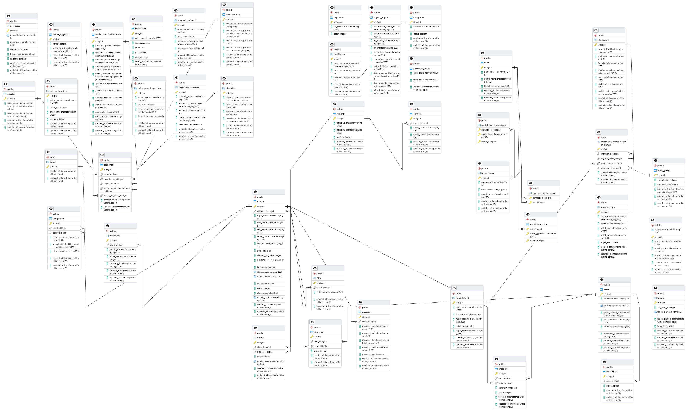

## About Template

This is ready admin panel template with
- [Laravel 8](https://laravel.com/docs/8.x)
- [Laravel-permissions (Spatie.be)](https://spatie.be/docs/laravel-permission/v3/introduction)
- [Authorization laravel/ui](https://github.com/laravel/ui)

Laravel is accessible, powerful, and provides tools required for large, robust applications.

## DB



B-N_(5xonali)-yil

composer require guzzlehttp/guzzle

1) manager ozini tumandigilani ko'rolishi kere  +++
2) tepadigi count lani ozini tumanidigla uchun bo;lishi kere  +++
3) address lani edit qganda olding addressi chqshi kere
working with ob


## PPTX
```
composer require phpoffice/phppresentation

php artisan make:controller ExportController
```
